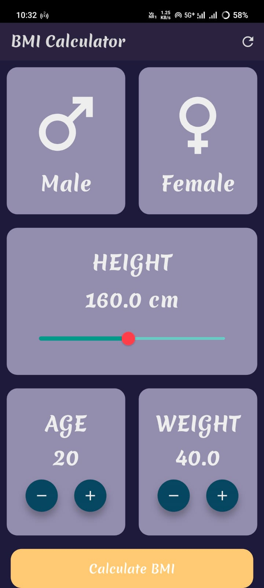
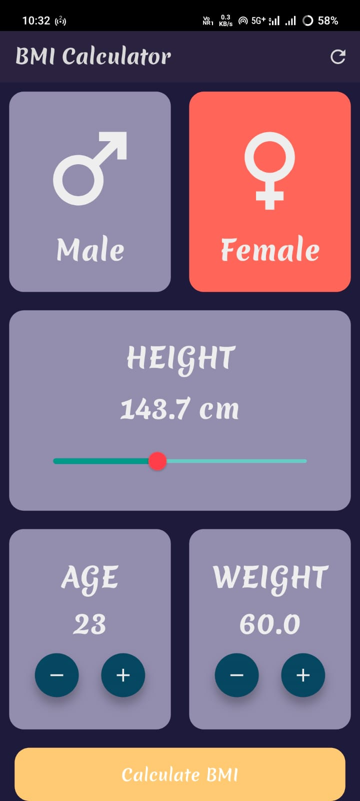
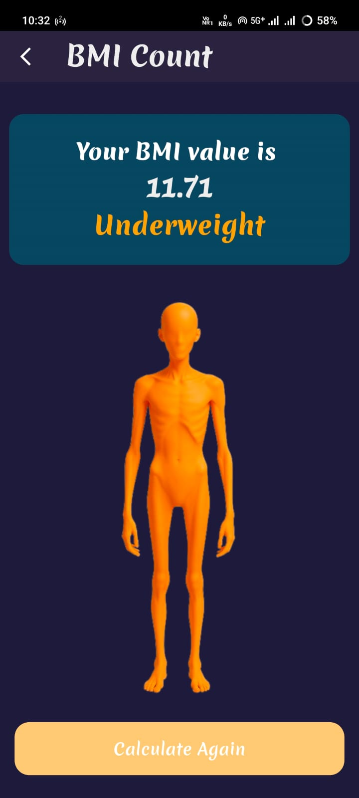
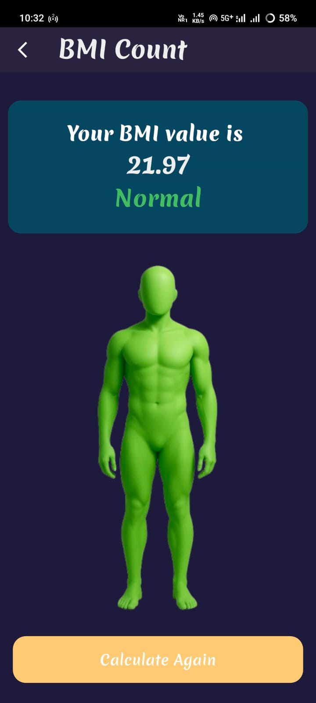
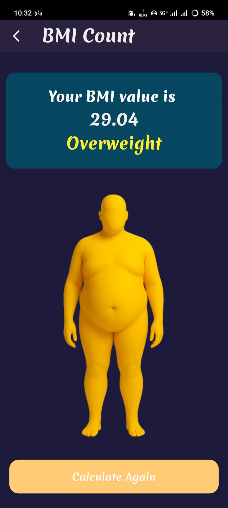
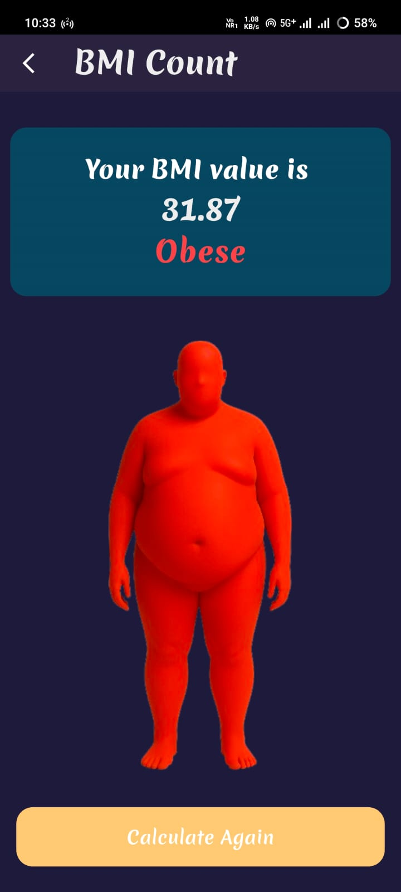
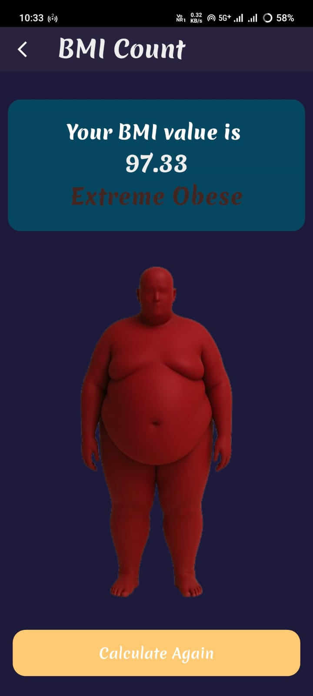

bmi_calculator 🧮
- A simple **BMI (Body Mass Index)** calculator build using **Flutter**.

## 📱Screenshots

### 🏠 Home Screen

- A **Reset** button is available in the AppBar to clear all the data on home page.

### 📊 Result Screen

## 🤯 Logic Used
- Takes height in **centimeters** and weight in **kilograms** from the user.

- Convert height in meters.

- Applies the formula:
   - BMI = weight/(height(m) * height(m)).

- Classified result into:
   - 🟠 Underweight
   - 🟢 Normal
   - 🟡 Overweight
   - 🔴 Obese
   - 🟤 Extreme Obese

## 🛠️ Build With
- **Flutter** (UI)
- **Dart** (Programming)

## 🙋‍♂️ Author
- Made with ❤️ by- [Rahul Mishra](https://github.com/rahulmishra-09)